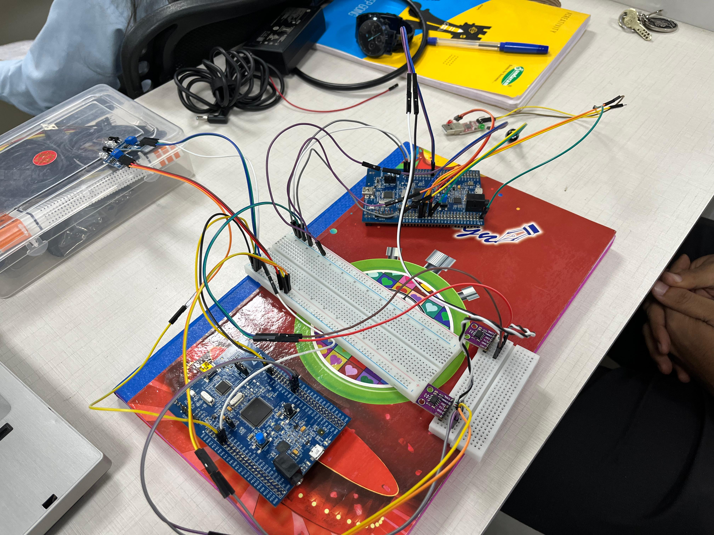

# 🚀 Speedometer Using STM32F407 Microcontroller

## 📌 Overview
This project is designed to measure and display speed using an **STM32F407** microcontroller. The system is capable of:
- Accurately calculating speed based on sensor input.
- Displaying real-time speed readings on a terminal.
- Processing data efficiently using embedded system techniques.

This system is particularly useful for **commercial vehicles, school zones, highways,** or areas with strict speed regulations.

## ✨ Features & Functionality
- **Real-time Speed Measurement** – Utilizes sensors to determine speed with high accuracy.
- **STM32F407 Integration** – Uses the STM32 microcontroller for processing and display.
- **CAN Bus Communication** – Transfers sensor data efficiently between STM32 boards.
- **UART Communication** – Displays speed readings in real-time on a serial terminal.
- **Embedded C Programming** – Developed using **Embedded C** for efficiency.
- **Speed Alerts** – Visual (LED) and auditory (buzzer) alerts for speed violations.
- **Energy Efficient** – Low power consumption for continuous monitoring.

## 🛠️ Technologies Used
- **Microcontroller**: STM32F407
- **Programming Language**: Embedded C
- **Development Environment**: STM32CubeIDE
- **Hardware Components**: IR sensors, STM32 development board, LEDs, Buzzer
- **Communication Protocols**: UART, CAN Bus

## 🚀 How It Works
This project presents a **speedometer system** utilizing STM32F407 for efficient data transmission, processing, and real-time speed calculation.

1. **System Architecture:**
   - The system involves **two STM32 boards**:
     - **First STM Board (Sensor Board)**:
       - Collects data from two **IR sensors** placed at a fixed distance.
       - Calculates the time difference between sensor activations.
       - Transmits the data to the **Second STM Board** via **CAN Bus**.
     - **Second STM Board (Processing & Display Board)**:
       - Receives time data from the first board.
       - Processes the speed using predefined formulas.
       - Displays the calculated speed on the **serial terminal (UART)**.
2. **Speed Alerts:**
   - If the vehicle is **below 40 km/h**, a **green LED** is activated (safe speed).
   - If the vehicle exceeds **40 km/h**, a **red LED** and **buzzer** are activated to alert the driver.

## 🚀 How to Run the Program
1. **Clone the Repository**
   ```sh
   git clone https://github.com/your-username/speedometer-stm32.git
   cd speedometer-stm32
   ```
2. **Build the Project**
   - Open the project in **STM32CubeIDE**.
   - Compile the code.
3. **Flash the Firmware**
   - Connect the **STM32F407** via **ST-Link**.
   - Flash the firmware using **STM32CubeProgrammer**.
4. **Hardware Setup**
   - Place the IR sensors at a fixed distance.
   - Connect LEDs and buzzer to the **Second STM Board**.
5. **Run the System**
   - Power the STM32 boards.
   - Observe real-time speed calculations on the **serial terminal**.
   - Ensure alerts (LED/Buzzer) activate when speed exceeds 40 km/h.

## 📌 Hardware Connections
### **First STM32 Board (Sensor Board)**
| Component | STM32 Pin |
|-----------|----------|
| IR Sensor 1 | GPIO Pin (e.g., PA0) |
| IR Sensor 2 | GPIO Pin (e.g., PA1) |
| CAN TX | CAN1_TX (e.g., PB9) |
| CAN RX | CAN1_RX (e.g., PB8) |

### **Second STM32 Board (Processing & Display Board)**
| Component | STM32 Pin |
|-----------|----------|
| LED (Green) | GPIO Pin (e.g., PC13) |
| LED (Red) | GPIO Pin (e.g., PC14) |
| Buzzer | GPIO Pin (e.g., PC15) |
| UART TX | USART2_TX (e.g., PA2) |
| UART RX | USART2_RX (e.g., PA3) |

## 📷 Experimental Setup


## 🎯 Future Improvements
- **Bluetooth / WiFi Module** for wireless speed monitoring.
- **Data Logging** for tracking speed over time.
- **Integration with Vehicle Dashboards** via CAN Bus.
- **Mobile App Support** for remote speed monitoring.
- **GPS Integration** for location-based speed tracking.
- **OLED/LCD Display** for real-time on-device speed display.

